# 使用文档 · 控制台导览

> 控制台是内核能力面的**操作界面**。这里出现的每一个数字都来自真实的内核状态——
> 实例、任务、审计条目、成本账单、隔离图……没有一处是演示用的假数据。
> 下面按导航分组逐页说明，截图来自一次真实运行（创建了 1 个实例 `box.agent-1` 并推演了 3 轮）。

控制台是本地自托管管理台（`node web/bridge-server.mjs`，默认 `:8899`），**不是多租户 SaaS**。
它分成四组导航：**工作台**、**证明**、**开发者控制台**（默认折叠）、**系统**。

---

## 0. 登录

本地首次启动会打印种子账号。登录页默认填好账号，输密码即可。

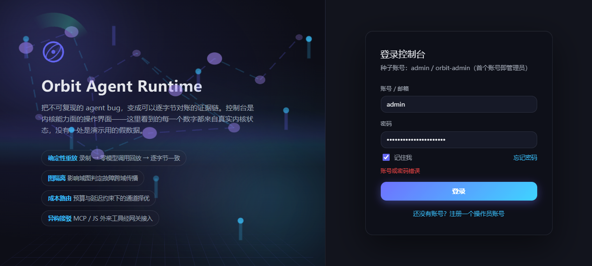

> 首个账号即管理员；密码登录带限流（同 IP+账号连续 5 次失败锁 30 秒）。

---

## 1. 工作台组

### 工作台（overview）

任务式首屏：顶部是系统健康（可运行 / 有告警 / 有故障）与合规状态；中间是**运行实例状态矩阵**——
正在跑的实例一览；下面是趋势与消耗图。

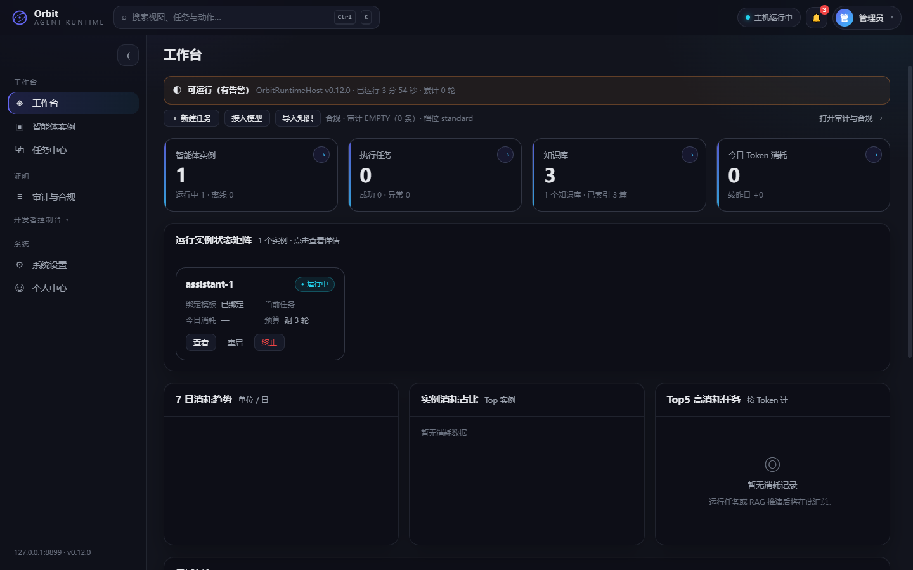

关键信息都在这一页：

- **系统健康徽章**：`可运行`、`有告警`、`有故障`——由守卫层诚实推导，不靠猜测。
- **合规状态**：`合规 · 审计 EMPTY (0 条) · 档位 standard`——告诉你审计链当前是否已签名。
- **运行实例矩阵**：列出每个实例、当前轮次、今日消耗、预算；可直接「查看 / 重跑 / 终止」。

### 智能体实例（boxes）

创建与运行实例。左侧生成表单（实例 ID、别名、循环预算 `maxCycleRun`、每轮成本预算、基础指令），
下方是实例池——每个实例一张卡：当前轮次、基础指令、预算、以及「详情 / 推演一轮 / 重置轮次 / 释放」。

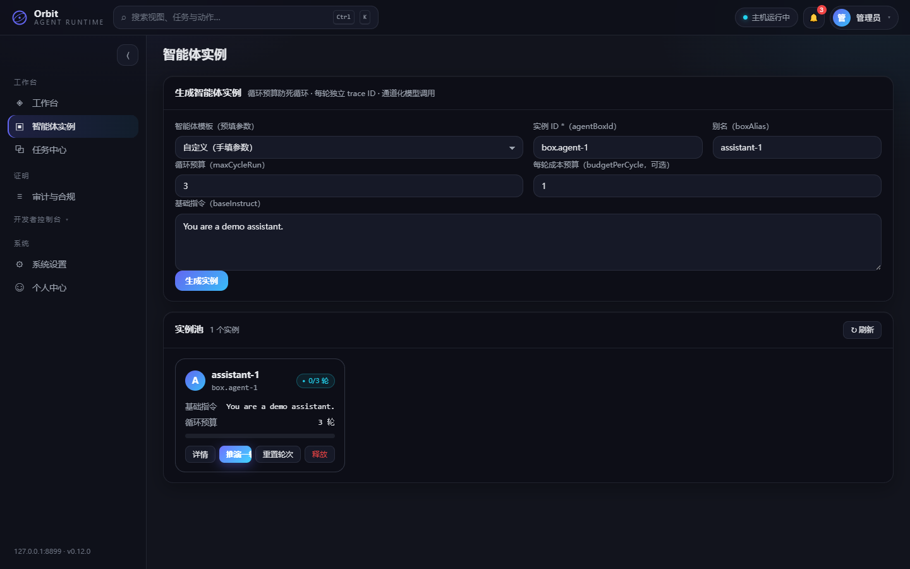

**推演一轮**会：生成新的 trace ID → 通道路由 → 记录审计 → 累加账单。预算在这里是防死循环的硬闸。

### 任务中心（tasks）

所有任务的运行记录。可按状态（排队 / 执行中 / 迭代中 / 已完成 / 异常中断 / 手动终止）
与类型（实例轮次 / 工作流编排 / RAG 推演）筛选。

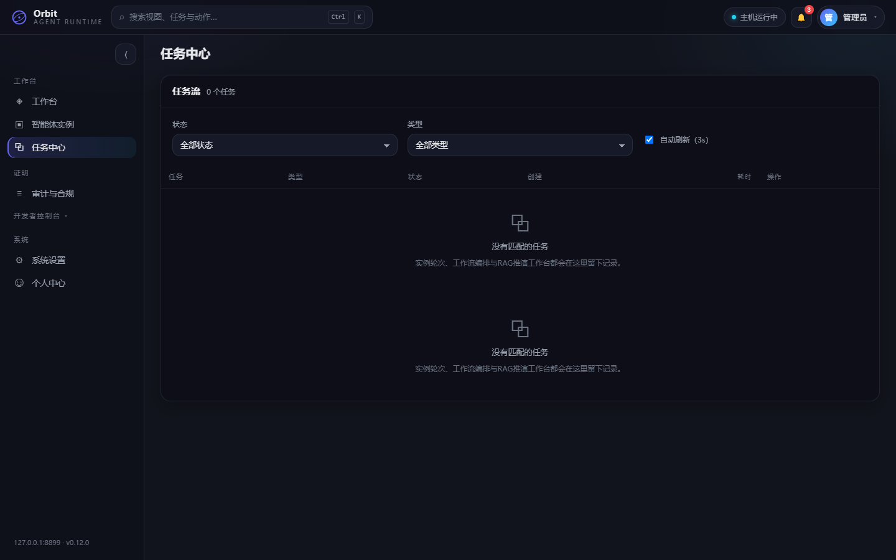

---

## 2. 证明组

### 审计与合规（trace）

**「证明」组只放给外部看的页面。** 这一页分三块：

1. **内核审计链完整性**——trace journal 的 HMAC 哈希链；配置 `auditSigningKey` 后为已签名。
2. **合规报告**——四态诚实推导：`EMPTY`（无审计）→ `UNSIGNED`（未签名）→ `PASS` → `FAIL`；
   可导出 Markdown / JSON / PDF（导出动作本身也会计入审计流）。
3. **平台审计器**——逐条审计事件，支持导出与自动刷新。

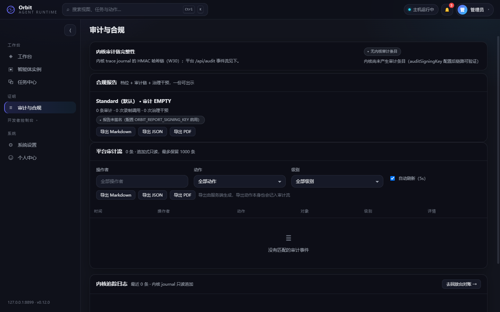

> 图上展示的是**未配置签名 key 的默认状态**（审计 EMPTY）。一旦设置 `auditSigningKey`
> 并运行受治理调用，这里会出现链卡：`entries=N · signed=true · consistent=true`。
> 出报告时用 ED25519 签章，第三方拿公钥即可验签——这是「日志是证据」的落地。

---

## 3. 开发者控制台组（默认折叠）

这一组是**内核机制的控制面**：图论、通道、适配器、重放调试。日常不需要展开，但了解每个页面
能帮你快速定位问题。

### 工作流编排（workflow）

把多个节点串成 DAG，编排层节点可以画布式连线；每个节点的**动作**走 Orbit 网关，被统一记录与计费。

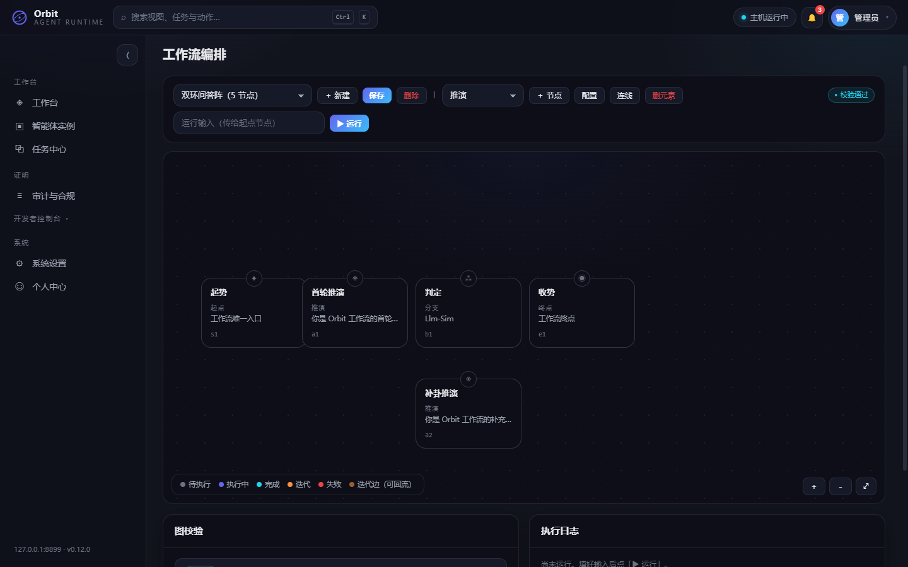

### 知识库管理（knowledge）

上传文档 → 切片 → 索引。这里展示切片、索引状态与每个知识库的规模（`01-overview.png` 里显示 3 个知识库、已索引 3 篇）。

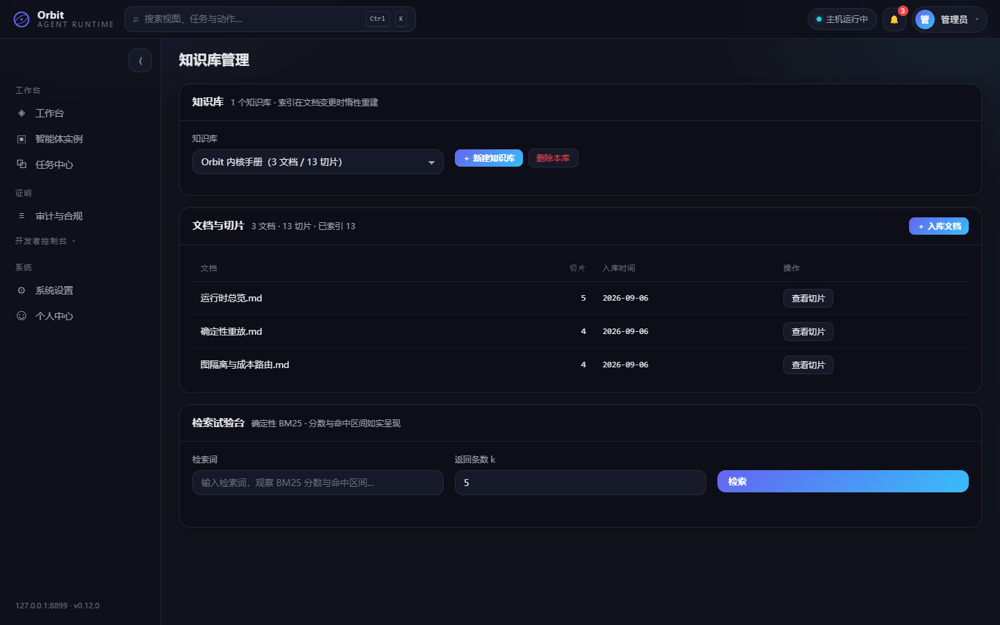

### 知识问答（rag）

检索增强问答工作台：提问 → 检索 → 推演 → 溯源，每一步都带引用与补搜判定。

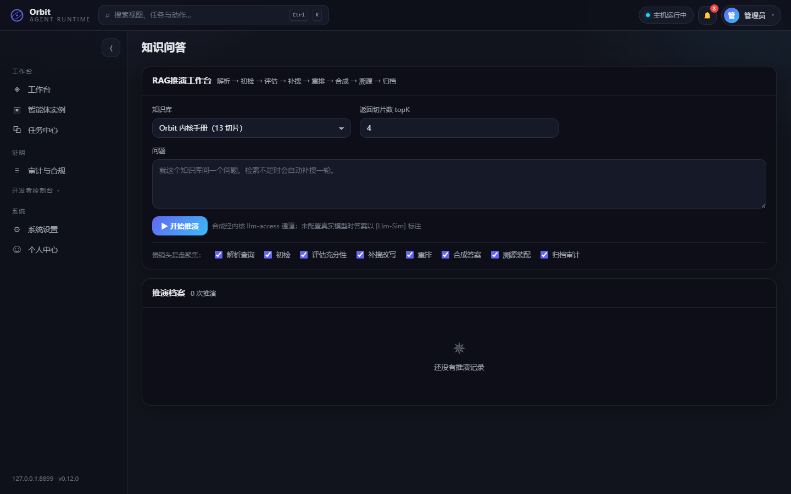

### 智能体模板（templates）

模板 = 人设 + 基础指令 + 版本。实例从模板派生，模板变化时可打版本。

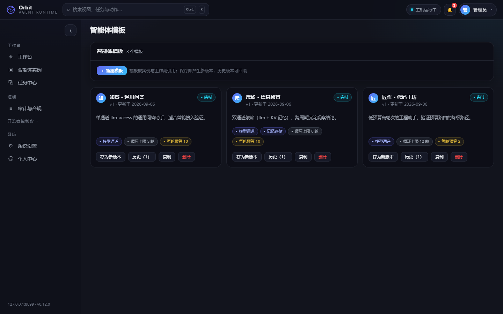

### 插件市场（plugins）

插件以 `pact`（契约）为中心：安装 / 市场 / 卸载。插件接入走网关，动作被审计与计费。

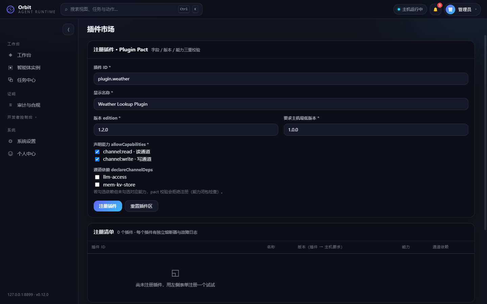

### 模型接入（channels）

通道（channel）= 模型提供方。**模型接入页承担了「异构适配器接驳橙」的角色**：DeepSeek /
OpenAI-compatible 等在此配置 baseUrl / model / key，供 `ctx.llm.chat` 路由。

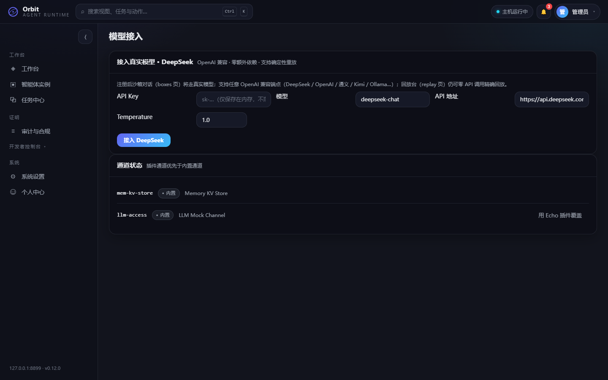

### 外部工具接入（pae）

PAE（Plug-in Adapter Engine）四步工作台：契约 → 适配 → 验证 → 接入，模板下拉含 MCP / JS / OpenAPI / Cordis。

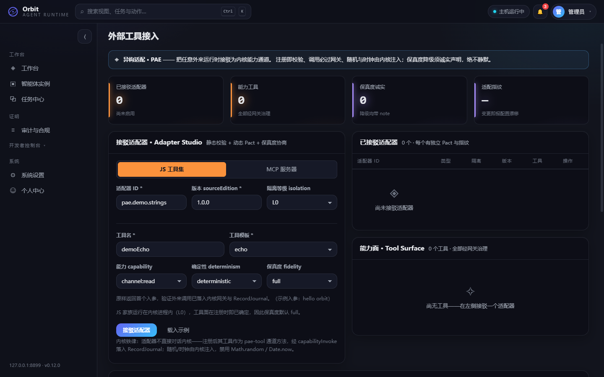

### 用量账单（billing）

按实例 / 通道统计 Token 消耗与成本，可看排行与余额。

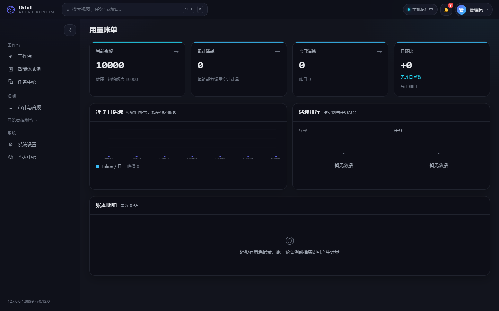

### 路由与预算（routing）

成本路由与预算模拟。在延迟与成本约束下为每次调用选择通道，并做预算 / 限额模拟。

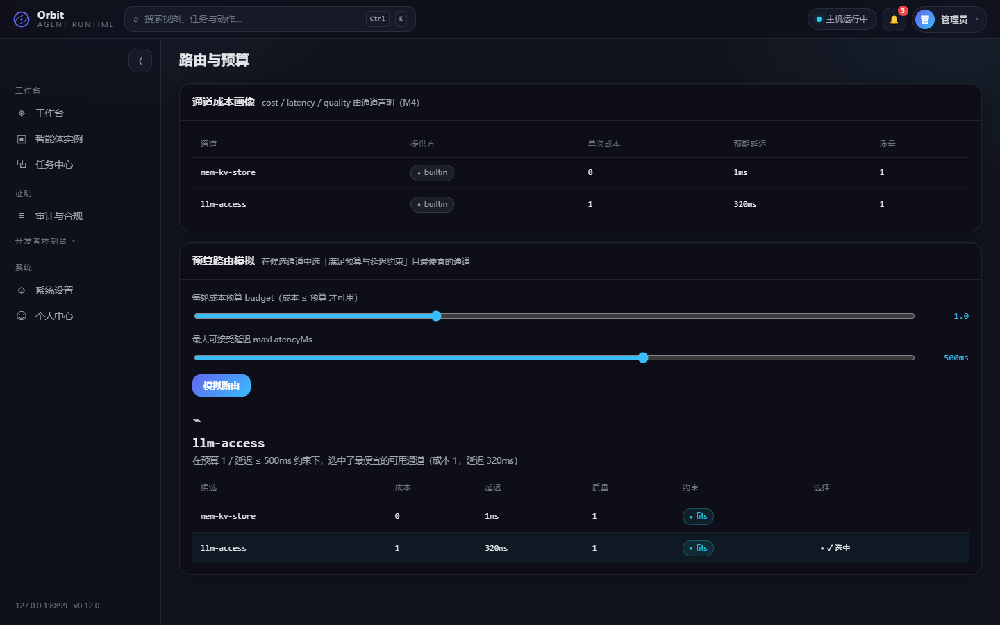

### 重放调试台（replay）

**Orbit 的灵魂页面**。重放调试台：录制 → 零调用重放 → 对账 digest。这里能看到
「重放结果是否与录制逐字节一致」，不一致时定位到第一个 drift 点。

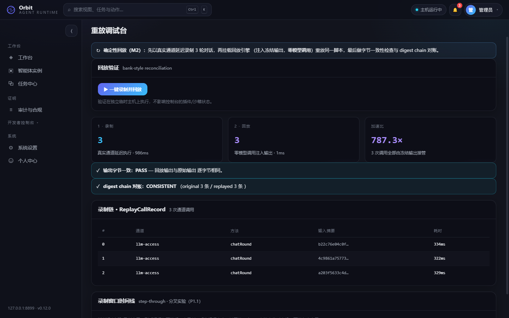

### 故障隔离图（graph）

**血缘谱系 · 休戚与隔离域**。节点间的依赖形成血缘，点击节点即可看到「它的故障会影响到谁」
（反向可达闭包）。图上是真实的内核状态：`box.agent-1 → llm-access`。

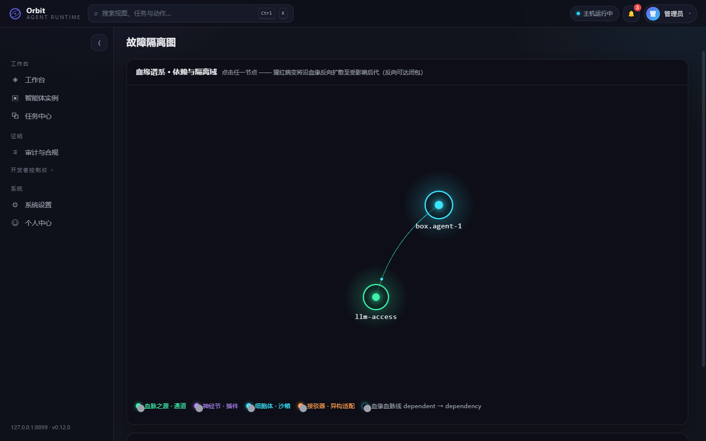

---

## 4. 系统组

### 系统设置（settings）

外观、安全、权限、动效与账号设置。

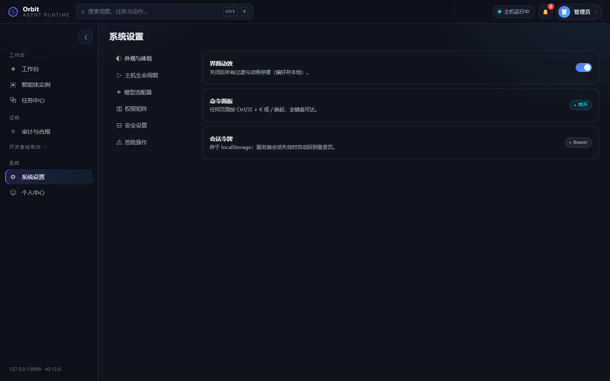

### 个人中心（profile）

账号信息与会话管理。

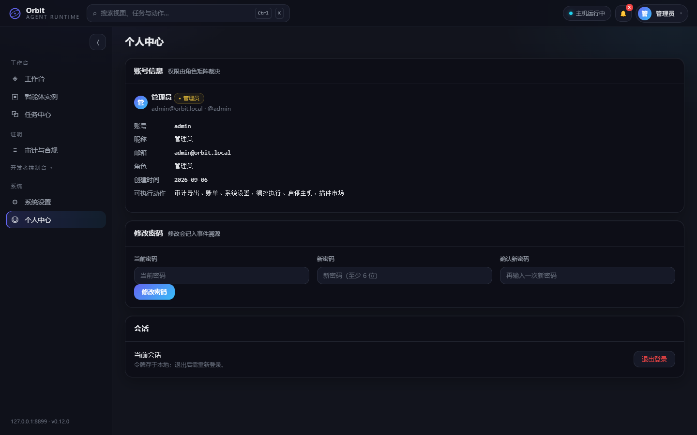

---

## 5. 从这个界面你能带走什么

| 你要做的事 | 去哪个页面 |
|---|---|
| 跑一个智能体、看任务结果 | 工作台 · 智能体实例 · 任务中心 |
| 给外部出示「这份日志可信」的证据 | 证明 · 审计与合规（链 + 报告 + 签章） |
| 排查「这次重放怎么不一致」 | 开发者 · 重放调试台 |
| 看懂「它挂了会不会连累别的」 | 开发者 · 故障隔离图 |
| 接入一个模型 / 一个外部工具 | 开发者 · 模型接入 · 外部工具接入 |
| 查钱花在哪了、要不要换通道 | 开发者 · 用量账单 · 路由与预算 |

> 想从命令行跑通同一套流程？回到[《快速上手》](./usage.html)。
